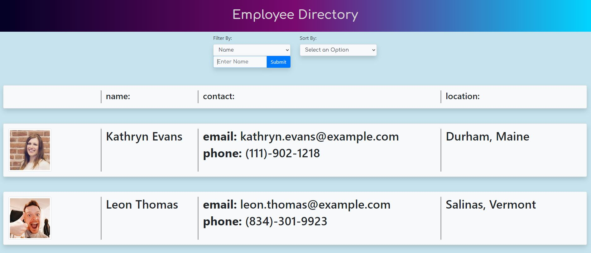

# Employee Directory
UCI Boot Camp Homework 19 - Employee Directory

Click [here](https://maxx105.github.io/employee_directory/) to open deployed Github pages application.

## Description 
 This was the nineteenth homework assignment for the full stack web development program at UC Irvine, in which the goal was to build an employee directory application using React. The application should display a table of random users and when the user loads the page, the table of employees should render. In addition, the user should be able to sort the table by at least one category and filter the users by at least one property.

## Table of Contents 
* [Technologies](#Technologies)
* [Usage](#Usage)
* [License](#License)
* [Badges](#Badges)
* [Tests](#Tests)
* [Questions](#Questions)

## Technologies 
* This application is written using the React.js javascript framework as well as JSX.
* It uses CSS/Bootstrap for styling.
* It requires node.js to run it.

## Usage 
If using from the Github pages deployed application, just go to the deployed application's [link](https://maxx105.github.io/employee_directory/). When the page is loaded, a list of 150 employees is rendered which includes a picture, their name, phone number, email address, and location. The user can click the filter by drop down and select whether they would like to filter by state or name. If name is chose, you can enter a string and click submit. It will filter the list of employees to include only those who name contains the string that was entered. If filtering by state, the state needs to be correctly typed in at which point on click of the submit button, it will filter the list to show only those whose location is that state. The user can also sort alphabetically, descending and ascending by first or last name by clicking the option in the sort by drop down. If running off a local server, first do an npm install then run the server by running the "npm start" command in a gitbash terminal. This will initialize the React app.

## License 
 ISC

## Badges 
 
 

## Tests 
 No tests are currently in place for this project.

## Questions 
 For any questions, contact me at [maxxsanner105@gmail.com](mailto:maxxsanner105@gmail.com).
#### 

